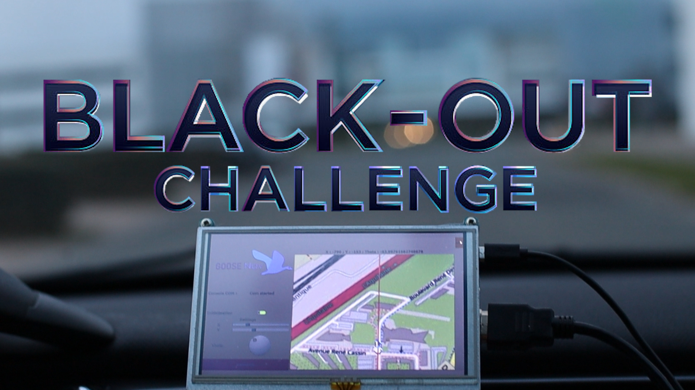

   

# The GooseNav project: An inter-locating network

[Safran Electronics & Defense](https://www.safran-electronics-defense.com/) organized the Black-Out Challenge in November 2019:

> "GNSS systems, requiered for civilian satellite navigation, are down. 
Air, sea and road traffic are severely affected. Imagine a fast deployable system to solve this planetary crisis."

The proposed solution is built on three main elements:
* A dead reckoning unit, combining inertial measurements and data collected from the vehicle through an OBD-II connection
* A network of fixed beacons broadcasting their position using Bluetooth Low Energy (BLE) to recalibrate the positioning system periodically
* A network of users sharing their live position estimate, thus improving the overall precision of the system

This prototype successfully demonstrates the precision of a simple dead-reckoning system without re-calibration.

[**See full demonstration**](https://youtu.be/mV7XY-ihbcE?t=102 "GooseNav")
